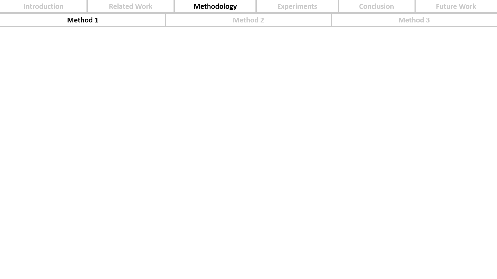

# PPT Navigation Generator

## Installation

```bash
git clone https://github.com/JHTNT/PPT-navigation-generator.git
cd PPT-navigation-generator

python -m venv .venv
source .venv/bin/activate  # Windows: .venv\\Scripts\\activate
pip install -e .
```

## Quick Start

```bash
ppt-nav outline.md              # Generate outline.pptx
ppt-nav outline.md slides.pptx  # Custom output filename

# Alternative
python -m ppt_nav outline.md
```

> [!warning]
> If you encounter a `Permission denied` issue, please close the open PowerPoint file first.

## Input Format

> [!note]
> Only two indentation levels are supported.

Example:

```markdown
- Introduction
- Related Work
  - Paper 1
  - Paper 2
- Methodology
  - Method 1
  - Method 2
  - Method 3
- Experiments
- Conclusion
- Future Work
```

## Screenshots


